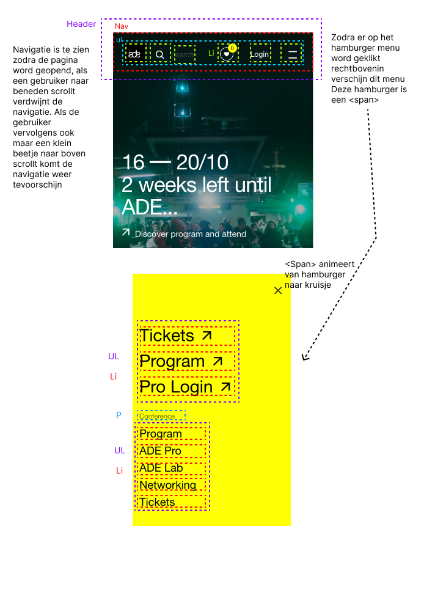

# Procesverslag
Markdown is een simpele manier om HTML te schrijven.  
Markdown cheat cheet: [Hulp bij het schrijven van Markdown](https://github.com/adam-p/markdown-here/wiki/Markdown-Cheatsheet).

Nb. De standaardstructuur en de spartaanse opmaak van de README.md zijn helemaal prima. Het gaat om de inhoud van je procesverslag. Besteedt de tijd voor pracht en praal aan je website.

Nb. Door *open* toe te voegen aan een *details* element kun je deze standaard open zetten. Fijn om dat steeds voor de relevante stuk(ken) te doen.

## Jij

  
uitwerken voor kick-off werkgroep

  ### Auteur:
  Lucas van hees

  #### Je startniveau:
  Blauw/Rood

  #### Je focus:
  Surface
 

## Je website

  
uitwerken voor kick-off werkgroep

  ### Je opdracht:
  https://www.amsterdam-dance-event.nl/en/

  #### Screenshot(s) van de eerste pagina (small screen): 
  ADE Homescherm
  https://www.amsterdam-dance-event.nl/en/
  
  

  #### Screenshot(s) van de tweede pagina (small screen):
  ADE - Celebrate Safe Pagina
  https://www.amsterdam-dance-event.nl/en/partners/celebrate-safe/33503/
    
        

 

## Toegankelijkheidstest 1/2 (week 1)

  
uitwerken na test in 2e werkgroep

  ### Bevindingen
  Lijst met je bevindingen die in de test naar voren kwamen:
- je hoort continu wat je aan het typen bent, letter voor letter word opgenoemd.
- op het moment dat ik naar mijn gekozen website toe ga, hoor ik de hele tijd "voer engels in afbeelding met codes die ik niet begrijp.
- elke handeling die je uitvoert word opgenoemd, alleen het is erg lastig om te weten wanneer dingen gebeuren aangezien dit pas word opgenoemd wanneer je daadwerkelijk ergens op klinkt.
- als je op google iets opzoekt word alles duidelijk opgenoemd. je hoort alle opties die er zijn om verder op te klikken.
- bij de screenreader kan je op het scherm ook zien dat wat er verteld word er een blauw vierkantje omheen komt wat op dat moment verteld word.
-   

## Breakdownschets (week 1)

  
uitwerken na afloop 3e werkgroep

  ### de hele pagina: 
  

  ### dynamisch deel (bijv menu): 
  

## Voortgang 1 (week 2)

  
uitwerken voor 1e voortgang

  ### Stand van zaken
  hier dit ging goed & dit was lastig (neem ook screenshots op van delen van je website en code)

  Ik heb vrijwel alle content op mijn website gekregen, ook heb ik al delen gestyled met css. Ik heb grids toegepast op plekken waar dit een handige oplossing was. Ik had wel moeite met de website in bepaalde delen op te splitstsen, bijvoorbeeld dat nu mijn h1 op de voorgrond staat van de video alleen ik wil wel graag de main van af onder de video laten beginnen. Hier moet ik dus nog even naar kijken. als ik dat gefixt heb kan ik gaan kijken om een parralex effect toe te voegen aan het begin van de pagina en daarna een side scroll onderaan de pagina.

  ### Agenda voor meeting
  samen met je groepje opstellen

  | student 1      | student 2          | student 3    | student 4        |
  | ---            | ---                | ---          | ---              |
  | dit bespreken  | en dit             | en ik dit    | en dan ik dat    |
  | en dat ook nog | dit als er tijd is | nog een punt | dit wil ik zeker |
  | ...            | ...                | ...          | ...              |

  ### Verslag van meeting
  hier na afloop snel de uitkomsten van de meeting vastleggen

  - Ik ben goed opweg, loop nu op schema
  - Mijn errors uit mijn website halen doormiddel van w3c validator
  - Proberen mijn bronnen goed bij te houden

## Voortgang 2 (week 3)

  
uitwerken voor 2e voortgang

  ### Stand van zaken
  hier dit ging goed & dit was lastig

  Begin een klein beetje vast te lopen met kleine dingetjes, zoals mijn h1 op dezelfde achtergrond als video. of sidescroll toevoegen en opmaak van de navigatie hetzelfde krijgen. 

  ### Agenda voor meeting
  samen met je groepje opstellen

  | student 1      | student 2          | student 3    | student 4        |
  | ---            | ---                | ---          | ---              |
  | dit bespreken  | en dit             | en ik dit    | en dan ik dat    |
  | en dat ook nog | dit als er tijd is | nog een punt | dit wil ik zeker |
  | ...            | ...                | ...          | ...              |

  ### Verslag van meeting
  hier na afloop snel de uitkomsten van de meeting vastleggen

  - Manier waarop ik mijn h1 heb gedaan en achtergrond video, mag op die manier zolang het werkt. als het niet meer werkt op een andere manier opmaken.
  - Styling van Navigatie moet nog aangepast worden, was nog niet voldoende

## Toegankelijkheidstest 2/2 (week 4)

  
uitwerken na test in 9e werkgroep

  ### Bevindingen
  Lijst met je bevindingen die in de test naar voren kwamen (geef ook aan wat er verbeterd is):

- Ik heb dit vrij laat gedaan pas, ik kwam erachter dat ik nog nergens een tabindex had toegevoegd en dit alleen dus op de <a> van toepassing was. 
- Ik had bij sommige  nog geen alt tekst geplaatst. Dit ben ik vervolgens bij elke afbeeling gaan doen, vervolgens toen ik verder door de checklist heen ging zag ik dat dit niet hoeft bij afbeeldingen die geen toegevoegde informatie gaven. Hierna ben ik dit weer gaan veranderen.
- Toen ik ging checken of mijn h1, h2, h3, etc. op de juiste volgorde stonden zag ik dat dit het geval was. Alleen als er het bij een section weer opnieiuw mag, dus zodra er een section is er weer een nieuwe h2 mag komen nadat erdaarvoor al een h3 was geweet.
- Ik las iets over een table tag, dit is iets wat ik nog nooit eerder heb gezien en weer iets nieuws over heb geleerd. Ik heb bijvoorbeeld gebruik gemaakt van grids, maar kennelijk had dit ook gekund met de table tag.
- Bij animation is het van belang om een pauze knop te hebben voor achtergrond video's, ik heb dit niet, maar ik heb toegepast dat als een gebruiker reduced motion aan heeft staan de video niet afspeeld. Als ik meer tijd had gehad had ik hier nog naar gekeken en dit toegepast op de hele website.
- 

## Voortgang 3 (week 4)

  
uitwerken voor 3e voortgang

  ### Stand van zaken
  hier dit ging goed & dit was lastig (neem ook screenshots op van delen van je website en code)

  Moet mijn tweede pagina nog maken, maar ben zo goed als klaar met mijn eerste. Heb een paar kleine vraagjes: Kunnen we samen kijken of ik genoeg surface onderdelen al heb?, zijn er nog een aantal die ik hier aan kan toevoegen?, samen nog kijken naar een andere tweede pagina vanwege tijdsnood. Moet je een nieuwe css bestand en javascript bestand aanmaken voor de tweede pagina?

  ### Agenda voor meeting
  samen met je groepje opstellen

  | student 1      | student 2          | student 3    | student 4        |
  | ---            | ---                | ---          | ---              |
  | dit bespreken  | en dit             | en ik dit    | en dan ik dat    |
  | en dat ook nog | dit als er tijd is | nog een punt | dit wil ik zeker |
  | ...            | ...                | ...          | ...              |

  ### Verslag van meeting
  hier na afloop snel de uitkomsten van de meeting vastleggen

  - Laat genoeg zien op eerste pagina, dus mijn tweede hoeft niet zo ontzettend spectaculair te zijn.
  - Ik heb genoeg surface plane onderdelen toegevoegd. kan misschien nog kijken naar een kleine micro animatie, als ik daar zin in heb.
  - Nieuwe tweede pagina gekozen, wat iets sneller in elkaar te zetten is. 
  - een nieuw css bestand voor de tweede pagina mag niet, een javascript bestand mag, maar hoeft niet.

## Eindgesprek (week 5)

  
uitwerken voor eindgesprek

  ### Je uitkomst - karakteristiek screenshots:
  
    

  ### Dit ging goed/Heb ik geleerd: 
  Korte omschrijving met plaatjes

 Ik heb vooral over mijzelf geleerd tijdens dit vak. Ik ben er achter gekomen dat ik coderen erg leuk en interresant vind. Ik weet wel dat mijn voorkeur meer ligt bij front-end dan back-end, aangezien ik design en de opmaak (html en vooral css) mij veel meer aanspreekt. 

  

  ### Dit was lastig/Is niet gelukt:
  Korte omschrijving met plaatjes

  Ik vond het lastig om de stof uit de lessen toe te passen, vaak was ik nog niet zo heel ver met mijn eigen site dus heb ik veel eigen onderzoek gedaan. Dit heeft wel erg geholpen in mijn proces, door een combinatie van eigen onderzoek en soms de codepen oefeningen als inspiratie te gebruiken.

  

## Bronnenlijst

  
continu bijhouden terwijl je werkt

  Nb. Wees specifiek ('css-tricks' als bron is bijv. niet specifiek genoeg). 
  Nb. ChatGpT en andere AI horen er ook bij.
  Nb. Vermeld de bronnen ook in je code.

1. Ik heb chatgpt om error uit mijn svg's en iframe te halen: https://chatgpt.com/c/66ed87ac-4694-8007-b841-7f1871fb1a02

2. Voor de interactie met mijn navigatie heb ik Chatgpt om hulp gevraagd: https://chatgpt.com/c/66f296f4-af9c-8007-a420-f524648eda98

3. hamburger menu tutorial: https://www.youtube.com/watch?v=aNDqzlAKmZc&ab_channel=Treehouse

4. Voor de animatie van mijn hamburger menu van hamburger naar kruisje heb ik om hulp gevraagd aan chatgpt: https://chatgpt.com/share/66fbbb8b-c9a4-8007-a33d-d58bcbed0552

5. Voor het namaken van het vergrootglas in mijn navigatie heb ik dit gevraagd aan Chatgpt: https://chatgpt.com/c/66f413fe-a870-8007-b5ad-aa0efb4377c3

6. Voor mijn grids heb ik gebruik gemaakt van css grid generator: https://cssgrid-generator.netlify.app/

7. Voor de esc shortcut heb ik om hulp gevraagd en uitleg aan Chatgpt: https://chatgpt.com/share/66fbbca8-bb5c-8007-8bf1-38c787783013

8. voor inspiratie voor mijn sidescroll heb ik om hulp gevraagd aan chatgpt: https://chatgpt.com/share/66fbc957-6f7c-8007-91b6-80aaa6d78675

9. Ik heb inspiratie opgedaan uit deze codepen voor de custom properties voor mijn website https://codepen.io/Dave-deo/pen/QWeWoqy

